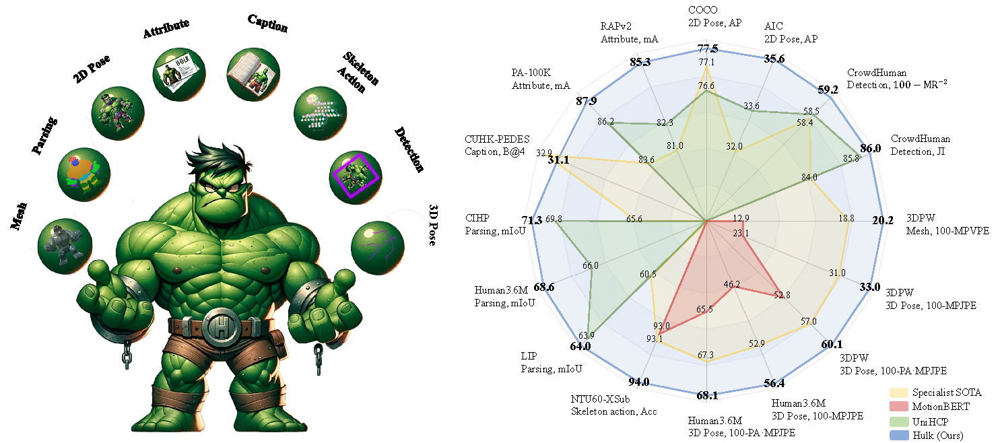

<div align='center'>

<h2>Hulk: A Universal Knowledge Translator for Human-centric Tasks</h2>

[Yizhou Wang](https://scholar.google.com/citations?user=CQGaGMAAAAAJ&hl=zh-CN&authuser=1)<sup>1*</sup>, [Yixuan Wu](https://scholar.google.com/citations?user=zjAxJcwAAAAJ&hl=en&oi=ao)<sup>1*,2</sup>, [Shixiang Tang](https://github.com/tangshixiang)<sup>1 :email:</sup>, [Weizhen He]()<sup>2,3</sup>, 
[Xun Guo](https://github.com/Space-Xun)<sup>1,4</sup>, [Feng Zhu](https://zhufengx.github.io/)<sup>3</sup>, [Lei Bai](http://leibai.site/)<sup>1</sup>, [Rui Zhao](http://zhaorui.xyz/)<sup>3</sup>, 
[Jian Wu]()<sup>2</sup>, [Tong He](http://tonghe90.github.io/)<sup>1</sup>, [Wanli Ouyang](https://wlouyang.github.io/)<sup>1</sup>

<sup>1</sup>[Shanghai AI Lab](https://www.shlab.org.cn/), <sup>2</sup>[ZJU](https://www.zju.edu.cn/), <sup>3</sup>[SenseTime](https://www.sensetime.com), <sup>4</sup>[USTC](https://www.ustc.edu.cn/)


[ArXiv](https://arxiv.org/abs/2312.01697) | [Project Page](https://humancentricmodels.github.io/Hulk/)


[](https://paperswithcode.com/sota/pose-estimation-on-aic?p=hulk-a-universal-knowledge-translator-for) 
[](https://paperswithcode.com/sota/human-part-segmentation-on-cihp?p=hulk-a-universal-knowledge-translator-for)
[](https://paperswithcode.com/sota/skeleton-based-action-recognition-on-ntu-rgbd?p=hulk-a-universal-knowledge-translator-for)
[](https://paperswithcode.com/sota/semantic-segmentation-on-lip-val?p=hulk-a-universal-knowledge-translator-for)
[](https://paperswithcode.com/sota/human-part-segmentation-on-human3-6m?p=hulk-a-universal-knowledge-translator-for)
[](https://paperswithcode.com/sota/pedestrian-attribute-recognition-on-rapv2?p=hulk-a-universal-knowledge-translator-for)
[](https://paperswithcode.com/sota/pedestrian-attribute-recognition-on-pa-100k?p=hulk-a-universal-knowledge-translator-for)
[](https://paperswithcode.com/sota/pose-estimation-on-coco?p=hulk-a-universal-knowledge-translator-for)
[](https://paperswithcode.com/sota/object-detection-on-crowdhuman-full-body?p=hulk-a-universal-knowledge-translator-for)

</div>

<p align="center">
    
</p>

Welcome to **Hulk**! Hulk is a multimodel human-centric generalist model, capable of addressing 2D vision, 3D vision, skeleton-based, and vision-language human-centric tasks. Unlike many existing human-centric foundation models that
did not explore 3D and vision-language tasks for human-centric and required task-specific finetuning, Hulk condensed various task-specific heads into two general heads, one for discrete representations, e.g., languages, 
and the other for continuous representations, e.g., location coordinates. Unifying these tasks enables Hulk to treat diverse human-centric tasks as modality translation, integrating knowledge across a wide range of tasks. 
For more details, please take a look at our paper [Hulk: A Universal Knowledge Translator for Human-centric Tasks](https://arxiv.org/abs/2312.01697).

<p align="center">
    
</p>

## News
- _Apr. 2024_ A pretrained Hulk is released on [🤗  Hugging Face Models](https://huggingface.co/OpenGVLab/Hulk/tree/main)!
- _Apr. 2024_ Project page with demos is released at [Hulk](https://humancentricmodels.github.io/Hulk/).
- _Mar. 2024_ Training and inference code are released!
- _Dec. 2023_ Hulk is released on [ArXiv](https://arxiv.org/abs/2312.01697)!

## Installation
This codebase has been developed with python version 3.9, pytorch 2.0.0, cuda 11.8 and torchvision 0.15.0. 
We recommend using the same version to avoid potential issues.
```bash
pip install -r requirements.txt
```
Also, download [bert-base-uncased](https://huggingface.co/google-bert/bert-base-uncased) from huggingface and put it under `experiments/release/`.

## Datasets
Please refer to the [datasets](docs/datasets.md) for more details.


## Training
Download pre-trained MAE weights from [here](https://dl.fbaipublicfiles.com/mae/pretrain/mae_pretrain_vit_base.pth) and put it under `core/models/backbones/pretrain_weights/`.

We use 10 nodes (80 A100 GPUs) for training with the following command:
```bash
cd experiments/release
sh train.sh 80 Hulk_vit-B
```

## Evaluation
A pretrained Hulk will be soon available at [🤗  Hugging Face Models](https://huggingface.co/OpenGVLab/Hulk/tree/main). 
Download it, put it under the folder `experiments/release/checkpoints/Hulk_vit-B` (first `mkdir -p experiments/release/checkpoints/Hulk_vit-B`), then use the following command to evaluate the model on the test set.
```bash
cd experiments/release
sh batch_eval.sh 1 Hulk_vit-B 
```

## Model Performance
We use the plain ViT as our backbone, develop four modality-specific tokenizers and de-tokenizers 
to cover 2D vision, 3D vision, skeleton-based, and vision-language human-centric tasks. 
Hulk has achieved state-of-the-art results on various human-centric tasks.

### Direct Evaluation
<table border="1" width="100%">
	<tr align="center">
      <th colspan="1"> Task  <th colspan="3"> pedestrian detection </th><th colspan="2"> 2D pose </th><th colspan="1">skeleton-based action</th><th colspan="3">human parsing</th> <th colspan="2"> attribute recognition </th> <th colspan="1"> image caption </th> <th colspan="5"> monocular 3D human pose and mesh recovery</th>
    </tr>
  	<tr align="center">
     <th colspan="1"> Dataset   <th colspan="3"> CrowdHuman </th><th colspan="1"> COCO </th><th colspan="1">  AIC </th><th colspan="1"> NTU60-XSub </th> <th colspan="1"> H3.6M</th> <th colspan="1"> LIP </th> <th colspan="1"> CIHP </th> <th colspan="1"> PA-100k </th> <th colspan="1"> RAPv2 </th> <th colspan="1"> CUHK-PEDES </th> <th colspan="3"> 3DPW </th> <th colspan="2"> H3.6M </th>
    </tr>
  <tr align="center">
        <!-- <th> Metric </th>  -->
      <th colspan="1"> Metric  <th> mAP </th> <th> MR<sup>-2</sup> </th> <th> JI </th> <th colspan="1"> AP </th><th colspan="1">AP</th><th colspan="1">acc.</th> <th> mIoU </th> <th>mIoU </th>  <th> mIoU </th> <th> mA </th>  <th> mA </th> <th> B@4 </th>  <th>MPVPE↓</th>  <th>MPJPE↓</th> <th> PA-MPJPE↓ </th>  <th> MPJPE↓ </th>  <th> PA-MPJPE↓ </th> 
    </tr>
    <tr align="center">
      <th colspan="1"> Hulk (ViT-B)  <th> 90.7 </th> <th> 43.8</th> <th> 84.0</th> <th colspan="1"> 77.0 </th> <th> 34.5 </th> <th>93.8 </th>       <th>  68.08 </th> <th> 63.95 </th>  <th> 70.58 </th> <th> 82.85 </th>  <th> 80.90 </th> <th> 31.1 </th> <th>79.8 </th>  <th> 67.0 </th> <th> 39.9 </th>  <th> 43.6 </th> <th> 31.9 </th>
    </tr>
    <tr align="center">
      <th colspan="1"> Hulk (ViT-L)  <th> 92.2 </th> <th> 40.1 </th> <th> 85.8 </th> <th colspan="1"> 78.3 </th> <th> 36.3 </th> <th>94.1</th>      <th>  69.31 </th> <th> 65.86 </th>  <th> 72.33 </th> <th> 84.36 </th>  <th> 82.85 </th> <th> 31.6 </th> <th> 77.4 </th>  <th> 66.3 </th> <th> 38.5</th>  <th> 40.3 </th> <th> 28.8 </th>
    </tr>
</table>
<br>


### Finetune Performance
<table border="1" width="100%">
	<tr align="center">
      <th colspan="1"> Task  <th colspan="3"> pedestrian detection </th><th colspan="2"> 2D pose </th><th colspan="1">skeleton-based action</th><th colspan="3">human parsing</th> <th colspan="2"> attribute recognition </th> <th colspan="1"> image caption ♣</th> <th colspan="5"> monocular 3D human pose and mesh recovery ♣ </th>
    </tr>
  	<tr align="center">
     <th colspan="1"> Dataset   <th colspan="3"> CrowdHuman </th><th colspan="1"> COCO </th><th colspan="1">  AIC </th><th colspan="1"> NTU60-XSub </th> <th colspan="1"> H3.6M</th> <th colspan="1"> LIP </th> <th colspan="1"> CIHP </th> <th colspan="1"> PA-100k </th> <th colspan="1"> RAPv2 </th> <th colspan="1"> CUHK-PEDES </th> <th colspan="3"> 3DPW </th> <th colspan="2"> H3.6M </th>
    </tr>
  <tr align="center">
        <!-- <th> Metric </th>  -->
      <th colspan="1"> Metric  <th> mAP </th> <th> MR<sup>-2</sup> </th> <th> JI </th> <th colspan="1"> AP </th><th colspan="1">AP</th><th colspan="1">acc.</th> <th> mIoU </th> <th>mIoU </th>  <th> mIoU </th> <th> mA </th>  <th> mA </th> <th> B@4 </th>  <th>MPVPE↓</th>  <th>MPJPE↓</th> <th> PA-MPJPE↓ </th>  <th> MPJPE↓ </th>  <th> PA-MPJPE↓ </th> 
    </tr>
    <tr align="center">
      <th colspan="1"> Hulk (ViT-B)  <th> 92.4 </th> <th> 40.7</th> <th> 86.0</th> <th colspan="1"> 77.5 </th> <th> 35.6 </th> <th>94.0 </th>       <th>  68.56 </th> <th> 63.98 </th>  <th> 71.26 </th> <th> 87.85 </th>  <th> 85.26 </th> <th> 28.3 </th> <th>80.7 </th>  <th> 68.9 </th> <th> 41.3 </th>  <th> 44.9 </th> <th> 32.0 </th>
    </tr>
    <tr align="center">
      <th colspan="1"> Hulk (ViT-L)  <th> 93.0 </th> <th> 36.5 </th> <th> 87.0 </th> <th colspan="1"> 78.7 </th> <th> 37.1 </th> <th>94.3</th>      <th>  69.89 </th> <th> 66.02 </th>  <th> 72.68 </th> <th> 88.97 </th>  <th> 85.86 </th> <th> 30.5 </th> <th> 79.9 </th>  <th> 68.3 </th> <th> 40.6</th>  <th> 41.4 </th> <th> 30.2 </th>
    </tr>
</table>
<br>

♣: We find that the performance of image caption and monocular 3D human pose and mesh recovery is not as good as the direct evaluation, indicating that overfitting may occur during finetuning.


## Contact
If you have any problem about our paper & code, feel free to contact [Yizhou Wang](wangyizhou@pjlab.org.cn) and [Yixuan Wu](wyx_chloe@zju.edu.cn). 

## Citation
If you find this work useful, please consider citing:
```bibtex
@article{wang2023hulk,
  title={Hulk: A Universal Knowledge Translator for Human-Centric Tasks},
  author={Wang, Yizhou and Wu, Yixuan and Tang, Shixiang and He, Weizhen and Guo, Xun and Zhu, Feng and Bai, Lei and Zhao, Rui and Wu, Jian and He, Tong and others},
  journal={arXiv preprint arXiv:2312.01697},
  year={2023}
}
```